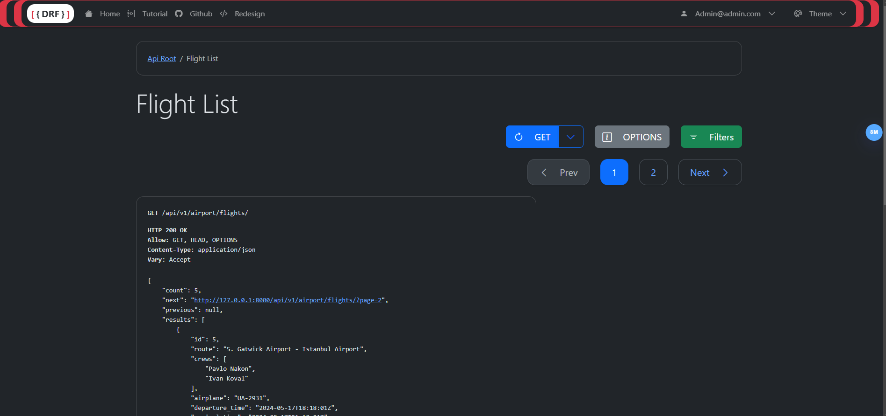

# Airport API Service.
API service for airport management written on DRF.

## Installing using GitHub.
Install PostgreSQL and create a new DB.

```
git clone https://github.com/pnakongit/airport-service.git
cd airport_service/
python -m venv venv
venv\Scripts\activate (on Windows)
source venv/bin/activate (on macOS)
pip install -r requirements.txt
set POSTGRES_DB = <your db name>
set POSTGRES_USER=<your db user name>
set POSTGRES_PASSWORD=<your db user password>
set POSTGRES_HOST = <your db host>
set POSTGRES_PORT = <your db port>
python manage.py migrate
python manage.py runserver
```

## Run with Docker.
Docker should be installed and .end file should be created.

```
docker-compose build
docker-compose up
```

## Getting access.

- create user via /api/v1/user/register/
- get access token via /api/v1/user/token/

## Features
__Functionality.__ The project allows administrators to create, edit, and delete routes to airports in different countries. 
It is possible to create flights for routes with different aircraft and crew members. Users can create orders with tickets for different flights. The list of flights can be filtered for the user's convenience. 

__Documentation.__ In the project the documentation is implemented using `drf-spectacular`. The documentation can be viewed via api/v1/schema/swagger-ui/ or /api/v1/schema/redoc/ . 

__Authentication.__ The project uses JWT authentication. 

__Browsable API.__ We used `rest-framework-redesign` to improve the look in the browser. 

## Demo

